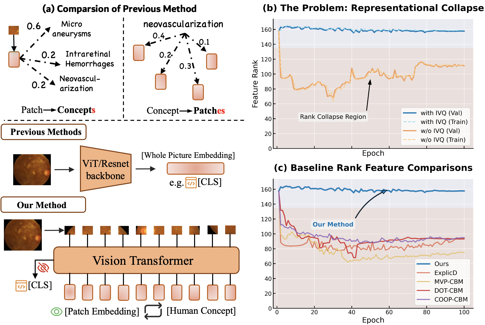
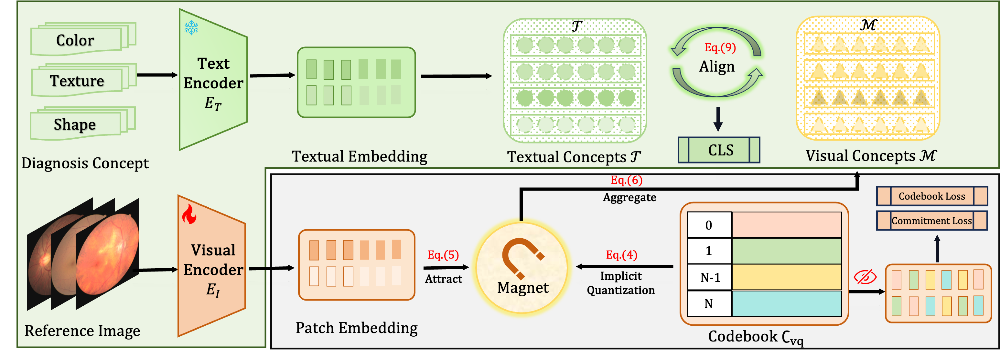

# Escaping Low-Rank Traps: Interpretable Visual Concept Learning via Implicit Vector Quantization
An official repository for our iclr 2026 accepted paper (poster), Escaping Low-Rank Traps: Interpretable Visual Concept Learning via Implicit Vector Quantization.

## Abstract

Concept Bottleneck Models (CBMs) achieve interpretability by interposing a human-understandable concept layer between perception and label prediction. We first identify that the condition of *many-to-many* mapping is necessary for robust CBMs, a prerequisite that has been largely overlooked in previous approaches. While several recent methods have attempted to establish this relationship, we observe that they suffer from the fundamental issue of *representation collapse*, where visual patch features degenerate into a low-rank subspace during training, severely degrading the quality of learned concept activation vectors, thus hindering both model interpretability and downstream performance.

To address these issues, we propose Implicit Vector Quantization (IVQ), a lightweight regularizer that maintains high-rank, diverse representations throughout training. Rather than imposing a hard bottleneck via direct quantization, IVQ learns a codebook prior that anchors semantic information in visual features, allowing it to act as a proxy objective. To further exploit these high-rank concept-aware features, we propose Magnet Attention, which dynamically aggregates patch-level features into visual concept prototypes, explicitly modeling the many-to-many vision–concept correspondence.

Extensive experimental results show that our approach effectively prevents representational collapse and achieves state-of-the-art performance on diverse benchmarks. Our experiments further probe the low-rank phenomenon in representational collapse, finding that IVQ mitigates the information bottleneck and yields cross-modal representations with clearer, more interpretable consistency.

Code is available at [https://github.com/Daryl-GSJ/IVQ-CBM](https://github.com/Daryl-GSJ/IVQ-CBM).


## Highlights
1. We identify that the key to CBMs lies in modeling the many-to-many relationship between concepts and patches. Furthermore, we identify and analyze representational collapse, a key challenge in training modern CBMs that hinders the establishment of CAVs.
2. We propose IVQ, a novel regularization method that preserves feature diversity and prevents representational collapse without creating an information bottleneck. To exploit obtained rich representations, we introduce the Magnet Attention mechanism to effectively aggregate the regularized patch features into semantically meaningful concept prototypes.
3. Extensive experiments on diverse benchmarks demonstrate that our IVQ-CBM consistently outperforms eight strong baselines, achieving state-of-the-art accuracy and learning better interpretable representations consistent with textual concepts.



## Method
1. Our method is quite simple and intuitive.

2. The proposed codebook in IVQ is dual-purpose. 1) Established as a lite regularizer to maintain elevated visual feature rank and feature diversity. 2) Pull each visual patch feature to its closed visual concept propotype (in codebook), which doesnot violate the intrinsic many-to-many mapping between patches and concepts.

3. Magent module serves as a ferature aggregation function, inwhich the network could learn dinstict visual concept for each corresponding textual concept, achiveing better cross-modality alignment.


## Usage
### Notes
1. Our project supports any image reconnition dataset with annotations (highly flexible). You only need to build .npy dataset (follow IVQ-CBM/dataset/build_datasets.py) and respective concepts to run this repo (see below).
2. For textual concepts, our project requires specific human-defined or llm-generated concepts for each dataset, we recommed you to generate concepts automatically.
3. Once you have generated concepts, you could put them into concepts.py, define the mapping from concepts to class names. The preparatory work is now complete.
4. For qucik deployment, we provide two datasets, i.e., ISIC2018 and BUSI, with respective textual concepts in IVQ-CBM/concepts.py. In the following, we will use these datasets for running.
5. Training data is available in https://drive.google.com/drive/folders/1z7ynsviy5CLgjdj3U0pIYOhPDeDh4Fs_?usp=sharing.

### Running
1. Build python running environment, eg. Python 3.9.21, torch 2.5.1. For quciker building, I suggent you directly use this instruction:
   pip install -r requirements.txt
2. Run: python train.py. You could adjust parameters, such as dataset, concept_dim, concept_num, and num_class_dict, to support different settings in different datasets.
3. Evaluate.
We also track the visual feature tranks throughout training, and store locally for visualization. -- Key motivation and finding in our work.

##  Acknowledgement
Our work in built upon previous excellent works, like Explicd, MVP-CBM, CLEAR, PCBM, and many more. Appreciate so much.


# Reference
If you find our work useful, please kindly cite it:

```
@inproceedings{gaoescaping,
  title={Escaping Low-Rank Traps: Interpretable Visual Concept Learning via Implicit Vector Quantization},
  author={Gao, Shujian and Wang, Yuan and Ma, Chenglong and Gao, Xin and Yan, Jiangtao and Ning, Junzhi and Tang, Cheng and Ji, Changkai and Xu, Huihui and Li, Wei and others},
  booktitle={The Fourteenth International Conference on Learning Representations}
}

```
