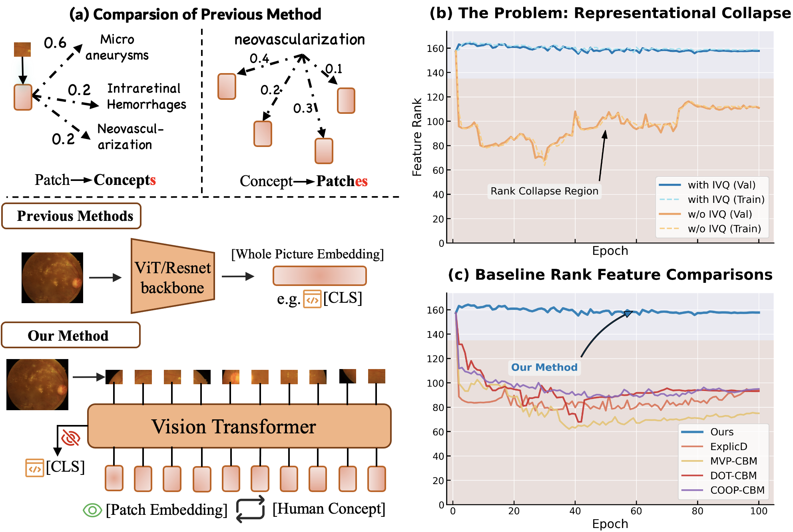
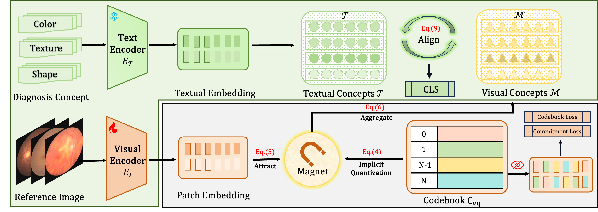

# Escaping Low-Rank Traps: Interpretable Visual Concept Learning via Implicit Vector Quantization

[](https://openreview.net/forum?id=9M2VrpAtR1)
[](https://github.com/Daryl-GSJ/IVQ-CBM)

This is the official repository for our ICLR 2026 accepted paper, **"Escaping Low-Rank Traps: Interpretable Visual Concept Learning via Implicit Vector Quantization."** For full details, please refer to our [OpenReview page](https://openreview.net/forum?id=9M2VrpAtR1).

## 📖 Abstract

Concept Bottleneck Models (CBMs) achieve interpretability by interposing a human-understandable concept layer between perception and label prediction. We first identify that the condition of *many-to-many* mapping is necessary for robust CBMs, a prerequisite that has been largely overlooked in previous approaches. While several recent methods have attempted to establish this relationship, we observe that they suffer from the fundamental issue of *representation collapse*, where visual patch features degenerate into a low-rank subspace during training. This severely degrades the quality of learned concept activation vectors, hindering both model interpretability and downstream performance.

To address these issues, we propose **Implicit Vector Quantization (IVQ)**, a lightweight regularizer that maintains high-rank, diverse representations throughout training. Rather than imposing a hard bottleneck via direct quantization, IVQ learns a codebook prior that anchors semantic information in visual features, allowing it to act as a proxy objective. To further exploit these high-rank concept-aware features, we propose **Magnet Attention**, which dynamically aggregates patch-level features into visual concept prototypes, explicitly modeling the many-to-many vision–concept correspondence.

Extensive experimental results show that our approach effectively prevents representational collapse and achieves state-of-the-art performance on diverse benchmarks. Our experiments further probe the low-rank phenomenon in representational collapse, finding that IVQ mitigates the information bottleneck and yields cross-modal representations with clearer, more interpretable consistency.

## ✨ Highlights
* **Identifying Representation Collapse:** We highlight that modeling the many-to-many relationship between concepts and patches is crucial for CBMs. We provide an in-depth analysis of *representational collapse*, a key challenge in training modern CBMs that hinders the establishment of Concept Activation Vectors (CAVs).
* **Novel IVQ Regularization & Magnet Attention:** We introduce IVQ to preserve feature diversity without creating an information bottleneck. Paired with our novel Magnet Attention mechanism, our model effectively aggregates regularized patch features into semantically meaningful concept prototypes.
* **State-of-the-Art Performance:** Extensive experiments across diverse benchmarks demonstrate that IVQ-CBM consistently outperforms eight strong baselines, achieving superior accuracy while learning interpretable representations that align beautifully with textual concepts.

## 💡 Key Insights & Analytical Value
Beyond chasing state-of-the-art performance, we believe the most compelling aspect of this paper is the explicit, legible lens it provides for analyzing cross-modal alignment. 

By tracking **visual feature rank dynamics throughout training**, we offer a transparent approach to observing and understanding how representations evolve. In contrast to previous works that primarily focus on baseline competition or textual concept intervention, our research examines CBMs from both mathematical and representation-learning perspectives. 

We hope this analytical technique and presentation style offer valuable insights for your own research!



## ⚙️ Method Overview
Our approach is simple, intuitive, and designed for seamless integration:
1. **Implicit Vector Quantization (IVQ):** The proposed codebook in IVQ serves a dual purpose. 1) It acts as a lightweight regularizer to maintain elevated visual feature rank and diversity. 2) It pulls each visual patch feature toward its closest visual concept prototype without violating the intrinsic many-to-many mapping between patches and concepts.
2. **Magnet Attention Module:** This serves as a feature aggregation function. It allows the network to learn distinct visual concepts for each corresponding textual concept, achieving highly robust cross-modality alignment.



## 🚀 Getting Started

### Prerequisites & Data Preparation
1. **Flexible Dataset Support:** Our project supports *any* image recognition dataset with annotations. You only need to build a `.npy` dataset (following `IVQ-CBM/dataset/build_datasets.py`) and define the respective concepts.
2. **Textual Concepts:** The model requires specific human-defined or LLM-generated concepts for each dataset. We recommend generating these automatically. Once generated, place them into `concepts.py` and define the mapping from concepts to class names.
3. **Quick Start Datasets:** For quick deployment, we provide the **ISIC2018** and **BUSI** datasets, with their respective textual concepts already configured in `IVQ-CBM/concepts.py`.
4. **Download Data:** Training data can be downloaded from our [Google Drive](https://drive.google.com/drive/folders/1z7ynsviy5CLgjdj3U0pIYOhPDeDh4Fs_?usp=sharing). Please download and place the files into the `data/` directory.

### Installation & Training
1. **Environment Setup:** We recommend using Python 3.9+ and PyTorch 2.5+. You can quickly build the environment using:
   ```bash
   pip install -r requirements.txt
